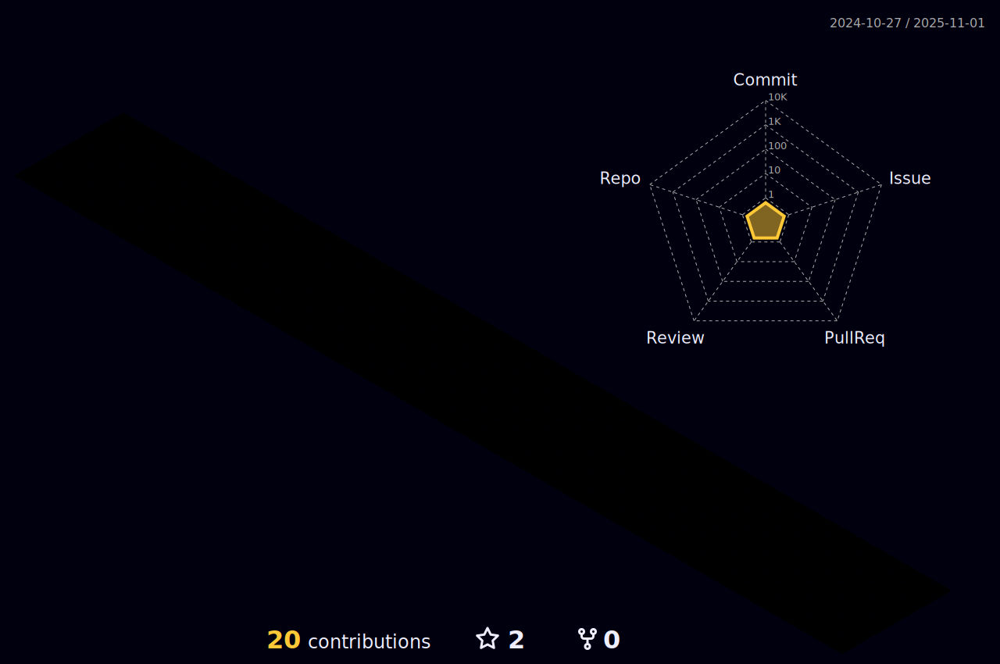

### Hi, i'm João Almeida! 👋

 

- 🔭 work as currently Administrative assistant
- 🌱  I’m currently learning Javascript | React

<!-- 

  <a href="https://github.com/joaolalmeida">
  
  

-->

 

  

 

> CONTACT

 
  
  
   
  
  
  
  

  
